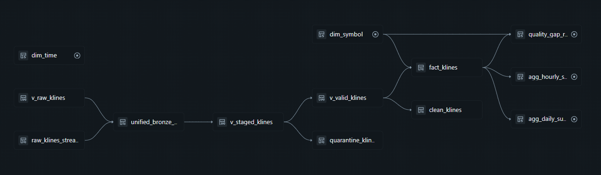
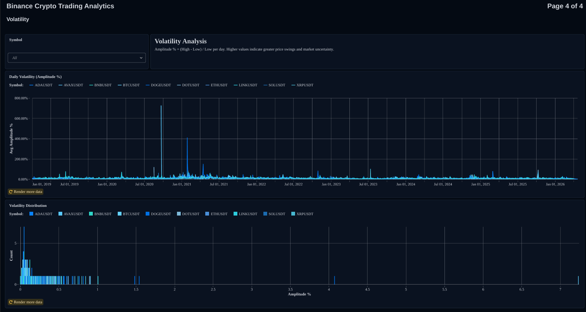

<div align="center">

# 🪙 Crypto Streaming Lakehouse Platform

### A production-grade, end-to-end data engineering platform that ingests, transforms, and serves real-time and historical Binance cryptocurrency market data using the Databricks Medallion Architecture.

<br/>

[](https://www.databricks.com/)
[](https://spark.apache.org/)
[](https://delta.io/)
[](https://www.python.org/)
[](https://azure.microsoft.com/en-us/products/event-hubs)
[](https://www.binance.com/)
[](LICENSE)

</div>

---

## 📌 Project Overview

The **Crypto Streaming Lakehouse Platform** is a fully automated, cloud-native data pipeline that collects, processes, and models cryptocurrency market data from Binance at **1-minute OHLCV (Open, High, Low, Close, Volume) granularity**, spanning from **2017 to present**.

The platform operates two parallel ingestion tracks:
- **Historical Bulk Ingestion** — Downloads monthly kline archives from the Binance Vision public data repository, covering years of market history per symbol.
- **Real-Time Streaming** — A continuously running WebSocket producer that forwards live candle updates from Binance to **Azure Event Hubs**, feeding a low-latency streaming pipeline in near real-time.

Both tracks converge into a unified **Medallion Architecture** (Bronze → Silver → Gold) powered by **Delta Live Tables (DLT)** and **Delta Lake**, deployed and orchestrated entirely via **Databricks Asset Bundles (DABs)**.

At current scale, the platform processes **253 million raw records** across historical and streaming ingestion flows.

---

## 🏗️ Architecture

### High-Level Architecture


### DLT Pipeline Flow

The animated diagram below shows the internal flow of the Delta Live Tables pipelines across all three Medallion layers:


---

## ⚙️ Technology Stack

| Layer | Component | Technology |
|---|---|---|
| **Orchestration** | Bundle & Job Management | Databricks Asset Bundles (DABs) |
| **Compute** | Processing Engine | Databricks Serverless |
| **Stream Processing** | Micro-batch & Continuous Streams | Apache Spark Structured Streaming |
| **Pipelines** | Transformation Framework | Delta Live Tables (DLT) |
| **Storage Format** | Table Format | Delta Lake |
| **Data Governance** | Catalog & Access Control | Unity Catalog |
| **Message Broker** | Real-Time Event Transport | Azure Event Hubs (Kafka-compatible) |
| **Historical Source** | Bulk Data Download | Binance Vision REST API |
| **Real-Time Source** | Live Market Feed | Binance WebSocket Streams |
| **BI & Dashboards** | Visualization | Databricks Dashboards |
| **Alerting** | Monitoring Alerts | Databricks SQL Alerts |
---

## 📁 Repository Structure

```
Crypto-Lakehouse-Platform/
│
├── Ingestion/                                      # One-time / on-demand historical bulk load
│   ├── metadata_ingestion.py                       # Fetches Binance exchange metadata → UC Volume
│   └── raw_data_ingestion.py                       # Downloads & unzips monthly kline CSVs (parallel)
│
├── notebooks/
│   └── producer.ipynb                              # Binance WebSocket → Azure Event Hubs producer
│
├── pipelines/
│   ├── Crypto Bronze Ingest/
│   │   └── bronze_pipeline.py                      # DLT: Auto Loader (CSV) + Kafka stream → Bronze
│   └── Crypto Silver Gold/
│       ├── silver_pipeline.py                      # DLT: Type casting, DQ validation, SCD1 upsert → Silver
│       └── gold_pipeline.py                        # DLT: Star schema (facts, dims, aggregates) → Gold
│
├── resources/
│   └── alerts.yml                                  # SQL Alerts: schema drift + quarantine monitoring
│   └── dashboard.yml                               # Dashboard Config file
│
├── dashboards/
│   ├── binance_crypto_trading_analytics.lvdash.json  # Lakeview dashboard definition
│   ├── Daily Price Action.png                      # Dashboard screenshot
│   ├── Market Sentiment.png                        # Dashboard screenshot
│   ├── Volatility.png                              # Dashboard screenshot
│   └── Volume Analysis.png                         # Dashboard screenshot
│   └── Binance_Crypto_Trading_Analytics.pdf        # PDF version of the dashboard
│
├── Screen shots/
│   ├── Binance Websocket.png                       # WebSocket producer runtime screenshot
│   ├── Event Hub.png                               # Azure Event Hub monitoring screenshot
│   ├── Streaming Job.png                           # Databricks streaming job screenshot
│   └── demo.mp4                                    # End-to-end Streaming demo video
|
│
├── docs/
│   ├── Data Dictionary.md                          # Column-level definitions across all layers
│   └── Governance.md                               # Naming conventions, DQ standards, best practices
├── diagrams
│   ├── Architecture Diagram.png                        # High-level architecture visual
│   ├── Pipeline Diagram.gif                            # Animated DLT pipeline flow
│   └── Star Schema.png                                 # Gold layer star schema diagram
│   └── Lineage.png                                     # Full data lineage diagram
|
└── databricks.yml                                  # DAB bundle: pipelines, jobs, schedules, targets

```

---

## 🔄 Data Pipeline — Deep Dive

The platform is built as a **4-phase pipeline** that moves data from raw source APIs all the way to a curated analytical Gold layer.

---

### Phase 0 — Historical Bulk Ingestion

> **Trigger:** One-time run (or on-demand via DAB job `Data Ingestion Workflow`). Idempotent — skips already-downloaded files.

#### Step 1 — Metadata Ingestion (`Ingestion/metadata_ingestion.py`)

Calls the Binance REST endpoint `GET /api/v3/exchangeInfo` and extracts the 90 tracked symbols. For each symbol, the script enriches the response with a custom `tracking_start_ts` field (the date data collection began), then writes the filtered JSON to the Unity Catalog Volume:

```
/Volumes/binance_platform/default/raw_data/metadata/exchange_info.json
```

This file later serves as the **source of truth** for the `dim_symbol` Gold table.

#### Step 2 — Raw Data Ingestion (`Ingestion/raw_data_ingestion.py`)

Downloads monthly 1-minute kline archives from the [Binance Vision](https://data.binance.vision/) public data repository:

```
https://data.binance.vision/data/spot/monthly/klines/{SYMBOL}/1m/{SYMBOL}-1m-{YEAR}-{MONTH}.zip
```

Key design decisions:
- **Idempotent**: checks if the target file already exists before downloading.
- Files are unzipped **in-memory** (`io.BytesIO`) — no temporary disk usage.
- Written to the Volume with Hive-style partitioning:
  ```
  /Volumes/binance_platform/default/raw_data/raw_klines/
  └── symbol=BTCUSDT/
      └── year=2024/
          └── month=01.csv
  ```

---

### Phase 1 — Real-Time WebSocket Producer

> **Trigger:** Runs continuously as a Databricks job (`binance-websocket`).

#### `notebooks/producer.ipynb`

Opens a **single multiplexed WebSocket connection** to Binance's combined stream endpoint, subscribing to all 90 `<symbol>@kline_1m` streams simultaneously:

```
wss://stream.binance.com:9443/stream?streams=btcusdt@kline_1m/ethusdt@kline_1m/...
```

**Key behaviors:**
- Messages are batched in memory (`BATCH_SIZE = 100`) and flushed to **Azure Event Hubs** using the async `EventHubProducerClient`.
- The batch is also flushed whenever the Azure SDK signals the batch size limit is reached (auto-flush on overflow).
- **Auto-reconnect logic**: on any WebSocket disconnection or error, the remaining batch is flushed before reconnecting after a `RETRY_DELAY_S = 5` second backoff.
- The Event Hub connection string is retrieved from **Databricks Secret Scope** (`trading_secrets/eventhub_connection_string`).
- All events are forwarded to the `klines-raw` Event Hub in the `binance-streaming` namespace.

#### Event Hub Snapshot


---

### Phase 2 — Bronze Layer (DLT Pipeline: Continuous)

> **Pipeline:** `Crypto Bronze Ingest` | **Mode:** Continuous | **Compute:** Serverless + Photon

`pipelines/Crypto Bronze Ingest/bronze_pipeline.py` defines three DLT assets that unify both ingestion tracks into a single Bronze table:

#### `v_raw_klines` — DLT View (Auto Loader / CSV Batch)

Uses Spark's **Auto Loader** (`cloudFiles` format) to incrementally ingest new CSV files as they land in the Volume. Key metadata columns are extracted at read time:

| Column | Source |
|---|---|
| `symbol` | Extracted from file path via regex (`symbol=([^/]+)`) |
| `ingestion_timestamp` | `current_timestamp()` |
| `source_system` | Literal `"binance_spot_rest"` |
| `source_file` | `_metadata.file_path` |

Schema evolution mode is set to `rescue` — any unexpected columns are captured in `_rescued_data` rather than failing the pipeline.

#### `raw_klines_stream` — DLT Table (Kafka / Event Hubs)

Reads from Azure Event Hubs via the Kafka-compatible protocol (SASL_SSL + PLAIN auth). Parses the JSON payload and flattens the nested Binance kline struct (`k`), mapping short field names (`o`, `h`, `l`, `c`, `v`, etc.) to descriptive column names.

#### `unified_bronze_klines` — DLT Table (Unified Source)

A `UNION` of both sources via `unionByName(allowMissingColumns=True)`, creating a **single Bronze source of truth** regardless of ingestion track. Deletion Vectors are enabled for efficient row-level operations.

---

### Phase 3 — Silver Layer (DLT Pipeline: Triggered every 5 min)

> **Pipeline:** `Crypto Silver Gold` | **Mode:** Triggered (5-min schedule) | **Compute:** Serverless

`pipelines/Crypto Silver Gold/silver_pipeline.py` enforces type safety, computes derived metrics, and applies data quality rules.

#### `v_staged_klines` — DLT View (Type Casting & Enrichment)

All raw string price/volume columns are cast to `Decimal(18,8)` for financial precision. Timestamps (stored as epoch ms or μs) are normalized to `TimestampType` using conditional logic that handles both millisecond and microsecond sources:

```python
F.when(F.col("open_time") > 9_999_999_999_999,
       (F.col("open_time") / 1_000_000).cast(TimestampType()))   # microseconds
 .otherwise(
       (F.col("open_time") / 1_000).cast(TimestampType()))       # milliseconds
```

Derived analytical columns computed at this stage:

| Column | Formula |
|---|---|
| `price_range` | `high - low` |
| `price_change` | `close - open` |
| `price_change_pct` | `(close - open) / open * 100` |
| `buy_sell_ratio` | `taker_buy_base_vol / volume` |

#### Data Quality Rules

Three rules are enforced. Records **passing all rules** flow to `clean_klines`; records **failing any rule** are routed to the Dead Letter Queue.

| Rule Name | Expression | Purpose |
|---|---|---|
| `valid_price` | `close > 0 AND high >= low` | Ensures OHLC logic is intact |
| `valid_timestamp` | `open_time_ts IS NOT NULL AND open_time_ts > '2018-12-31'` | Rejects corrupt or epoch-zero timestamps |
| `valid_symbol` | `symbol IS NOT NULL` | Ensures every record has a valid symbol |

#### `quarantine_klines` — Dead Letter Queue (DLT Table)

Failed records are stored with a `quarantine_ts` and a `failed_rule` column that identifies the first violated rule. This allows analysts to audit and reprocess bad data without blocking the main pipeline.

#### `clean_klines` — Silver Streaming Table (SCD Type 1)

Uses `dlt.apply_changes()` to upsert validated records into the Silver table, keyed on `(symbol, open_time_ts)`. This handles **late-arriving records** and **duplicate messages** from the two ingestion tracks gracefully — the latest version always wins (SCD Type 1).

```
binance_platform.silver.clean_klines   → valid records (SCD1 upsert)
binance_platform.silver.quarantine_klines → failed records (DLQ)
```

---

### Phase 4 — Gold Layer (DLT Pipeline: Triggered every 5 min)

> **Pipeline:** `Crypto Silver Gold` | **Mode:** Triggered (5-min schedule)

`pipelines/Crypto Silver Gold/gold_pipeline.py` builds a **Star Schema** optimized for BI and quantitative analysis.

#### `dim_symbol` — Symbol Dimension

Reads `exchange_info.json` from the UC Volume and assigns a deterministic `symbol_id` surrogate key (via `row_number()` ordered by symbol name). Contains base asset, quote asset, precision, and `tracking_start_ts`.

#### `dim_time` — Time Dimension

A pre-built **minute-grain time dimension** spanning 2017 → 2027 (~5M rows). Provides rich date attributes:

| Attribute | Examples |
|---|---|
| `year`, `month`, `day`, `hour`, `minute`, `quarter` | `2024`, `4`, `17`, `14`, `30`, `2` |
| `day_name` / `day_name_short` | `"Wednesday"` / `"Wed"` |
| `is_weekend` | `true` / `false` |
| `trading_session` | `"Asia"` (0–7h) · `"Europe"` (8–15h) · `"US"` (16–23h) |
| `date` | `2024-04-17` |

#### `fact_klines` — Core Fact Table

The central fact table at **1-minute grain per symbol**. Joins the validated Silver stream with `dim_symbol` (broadcast join for efficiency). Applies a **5-minute watermark** and deduplicates on `(symbol, open_time_ts)` before writing. Two `@dlt.expect_or_fail` guards ensure referential integrity — any record with a null `symbol_id` or `timestamp_key` fails the pipeline immediately.

Clustered on `["symbol_id", "timestamp_key"]` for optimal query performance.

#### `agg_hourly_summary` — Hourly Aggregates

Rolls up `fact_klines` to hourly grain, computing advanced market analytics:

| Metric | Formula | Meaning |
|---|---|---|
| `vwap` | `Σ(quote_volume) / Σ(base_volume)` | Volume-Weighted Average Price |
| `amplitude_pct` | `(max_high - min_low) / first_open` | Intraday volatility range |
| `buy_pressure_ratio` | `Σ(taker_buy_vol) / Σ(total_vol)` | Aggressor buy sentiment (0–1) |

Clustered on `["symbol_id", "hour_start"]`.

#### `agg_daily_summary` — Daily Aggregates

Identical structure to `agg_hourly_summary` but rolled up to **UTC day grain**. Clustered on `["symbol_id", "date"]`.

#### `quality_gap_report` — Data Completeness Monitor

Detects **missing 1-minute candles** in the last 7 days per symbol. Uses a cross-join of an expected minute matrix (7 × 24 × 60 rows) against `dim_symbol`, then a `left_anti` join against `fact_klines` to surface any gaps. The result is a table of `(symbol, missing_minute)` pairs for monitoring and alerting.

---

## Data Model — Star Schema


### Gold Layer Tables

| Table | Type | Grain | Primary Key |
|---|---|---|---|
| `fact_klines` | Fact | 1 minute × symbol | `(symbol_id, timestamp_key)` |
| `dim_symbol` | Dimension | 1 row per trading pair | `symbol_id` |
| `dim_time` | Dimension | 1 row per UTC minute | `timestamp_key` |
| `agg_hourly_summary` | Aggregate | 1 hour × symbol | `(symbol_id, hour_start)` |
| `agg_daily_summary` | Aggregate | 1 day × symbol | `(symbol_id, date)` |
| `quality_gap_report` | Operational | Missing minutes (last 7 days) | `(symbol, missing_minute)` |

### Unity Catalog Structure

```
binance_platform (catalog)
├── default
│   └── raw_data
│       ├── metadata
│       └── raw_klines
├── bronze
│   ├── unified_bronze_klines
│   └── raw_klines_stream
├── silver
│   ├── clean_klines
│   └── quarantine_klines
└── gold
    ├── fact_klines
    ├── dim_symbol
    ├── dim_time
    ├── agg_hourly_summary
    ├── agg_daily_summary
    └── quality_gap_report
```

---

## 🔗 Data Lineage

The diagram below traces the full end-to-end lineage of every data asset in the platform — from raw data through each Medallion layer.



---

## 📊 Dashboard & Observability

### Lakeview Dashboard

The platform ships with a fully-configured **Databricks dashboards** (`dashboards/binance_crypto_trading_analytics.lvdash.json`) with four analytical tabs, each targeting a distinct view of the market:

---

#### 📉 Daily Price Action
Visualizes per-symbol OHLCV candles, closing price trends, and daily price change percentage across the 90 tracked pairs.


---

#### 🧠 Market Sentiment
Tracks the **buy pressure ratio** and **buy/sell imbalance** over time, giving insight into whether the market is being driven by aggressive buyers or sellers.


---

#### 📊 Volatility
Displays **amplitude percentage** (intraday high-low range relative to open), helping identify volatile periods and compare volatility across symbols.



---

#### 🔊 Volume Analysis
Breaks down **total base volume**, **quote asset volume**, **VWAP**, and **taker buy volume** — offering a complete picture of market participation and liquidity.


---

### SQL Alerts (`resources/alerts.yml`)

Two automated SQL alerts run on a schedule to detect data quality and pipeline health issues, sending email notifications to the workspace owner:

| Alert | Trigger Condition | Schedule | Severity |
|---|---|---|---|
| **Schema Drift Detected** | `_rescued_data IS NOT NULL` count > 0 in the last 15 minutes in `bronze.raw_klines_stream` | Every 15 min | 🔴 CRITICAL |
| **Records in Quarantine** | > 5 records written to `silver.quarantine_klines` in the last 1 hour | Every 30 min | 🟡 WARNING |

The **Schema Drift** alert fires when Binance changes the shape of the WebSocket payload — rescued columns appear in `_rescued_data`, which signals a breaking upstream change requiring schema review.

The **Quarantine** alert fires when an unusual volume of records fail data quality validation, indicating a potential data integrity issue from the source.

---

## 🏛️ Data Governance

### Naming Conventions

| Layer | Table Naming Pattern | Example |
|---|---|---|
| Bronze | `[catalog].bronze.[entity]` | `binance_platform.bronze.unified_bronze_klines` |
| Silver (Valid) | `[catalog].silver.[entity]` | `binance_platform.silver.clean_klines` |
| Silver (DLQ) | `[catalog].silver.quarantine_[entity]` | `binance_platform.silver.quarantine_klines` |
| Gold (Fact) | `[catalog].gold.fact_[entity]` | `binance_platform.gold.fact_klines` |
| Gold (Dim) | `[catalog].gold.dim_[entity]` | `binance_platform.gold.dim_symbol` |
| Gold (Agg) | `[catalog].gold.agg_[metric]` | `binance_platform.gold.agg_hourly_summary` |

### Audit Columns (Required on all layers)

| Column | Type | Purpose |
|---|---|---|
| `ingestion_timestamp` | Timestamp | When the record entered the Bronze layer |
| `source_file` | String | File path in the Volume (batch) or `"event_hub_stream"` (streaming) |
| `source_system` | String | `"binance_spot_rest"` or `"binance_spot_websocket"` |

### Storage & Performance Best Practices

- **Storage Format:** All tables use native Delta Lake format.
- **Precision:** All price and volume columns are `Decimal(18,8)` — avoiding floating-point inaccuracies inherent to `DoubleType` in financial data.
- **Clustering:** Liquid Clustering is used on high-cardinality query columns (`symbol`, `open_time_ts`) instead of traditional Hive partitioning.
- **Deletion Vectors:** Enabled on Bronze and Silver tables to accelerate row-level `UPDATE` and `DELETE` operations.
- **Change Data Feed:** Enabled on Silver tables to support efficient incremental downstream processing.
- **SCD Strategy:** Silver uses **SCD Type 1** (latest-value overwrite) via `dlt.apply_changes()` — late arrivals always update, never duplicate.

---

## 🗺️ Databricks Asset Bundle (DAB) Configuration

The entire platform is deployed and managed via `databricks.yml`. The bundle defines **2 DLT pipelines** and **4 jobs**:

### DLT Pipelines

| Pipeline | Mode | Libraries |
|---|---|---|
| `Crypto Bronze Ingest` | **Continuous** | `bronze_pipeline.py` |
| `Crypto Silver Gold` | **Triggered** | `silver_pipeline.py` + `gold_pipeline.py` |

### Jobs

| Job Name | Type | Description | Schedule |
|---|---|---|---|
| `binance-websocket` | Continuous Notebook | Runs `producer.ipynb` — maintains the Binance WebSocket → Event Hubs connection | Always on (unpaused) |
| `Data Ingestion Workflow` | Triggered (4-task chain) | Sequential: `metadata_ingestion` → `raw_data_ingestion` → Bronze DLT refresh → Silver/Gold DLT refresh | On-demand |
| `Silver Gold Refresh` | Scheduled | Incrementally refreshes the Silver/Gold DLT pipeline | Every 5 minutes (UTC) |

---

## 🚀 Getting Started

### Prerequisites

- Databricks workspace with **Unity Catalog** enabled
- **Azure Event Hubs** namespace (`binance-streaming`) with an Event Hub named `klines-raw`
- Databricks CLI v0.200+ installed and authenticated
- Python 3.8+

### 1. Clone the Repository

```bash
git clone https://github.com/Yousefuwk20/Crypto-Lakehouse-Platform.git
cd Crypto-Lakehouse-Platform
```

### 2. Set Up Databricks Secret Scope

Create a secret scope and store the Event Hubs connection string. The connection string is used by both the WebSocket producer and the Bronze DLT pipeline.

```bash
databricks secrets create-scope trading_secrets
databricks secrets put-secret trading_secrets eventhub_connection_string \
  --string-value "Endpoint=sb://binance-streaming.servicebus.windows.net/;SharedAccessKeyName=...;SharedAccessKey=..."
```

### 3. Authenticate the Databricks CLI

```bash
databricks configure --token
# Enter your workspace URL and personal access token when prompted
```

### 4. Deploy the Bundle

```bash
# Deploy to development (default)
databricks bundle deploy --target dev

# Deploy to production
databricks bundle deploy --target prod
```

### 5. Run Historical Ingestion (One-time)

This job runs the 4-task chain: metadata fetch → CSV download → Bronze refresh → Silver/Gold refresh.

```bash
databricks bundle run data_ingestion_workflow --target dev
```

> ⏱️ Downloading all 90 symbols from 2017 to present (monthly CSVs) may take 15–30 minutes depending on network throughput. The job is fully idempotent — safe to re-run.

### 6. Start the WebSocket Producer

```bash
databricks bundle run websocket_producer --target dev
```

This starts the continuous Binance WebSocket → Event Hubs producer notebook. It will run indefinitely and auto-reconnect on failures.

### 7. Activate the Scheduled Refresh

The `Silver Gold Refresh` job is pre-configured to run every 5 minutes (unpaused). It starts automatically after bundle deployment.

To verify it's running:

```bash
databricks bundle run silver_gold_refresh --target dev
```

### 8. Import the Lakeview Dashboard

In your Databricks workspace:

1. Navigate to **Dashboards** → **Import**
2. Upload `dashboards/binance_crypto_trading_analytics.lvdash.json`
3. Connect the dashboard widgets to your `binance_platform` catalog

---

## 📚 Additional Documentation

| Document | Description |
|---|---|
| [📖 Data Dictionary](docs/Data%20Dictionary.md) | Full column-level definitions, data types, and business logic for all Gold, Silver, and Bronze tables |
| [🏛️ Governance Standards](docs/Governance.md) | Naming conventions, data quality rules, schema standards, and storage best practices |

---

## 📄 License

This project is licensed under the **MIT License**.
